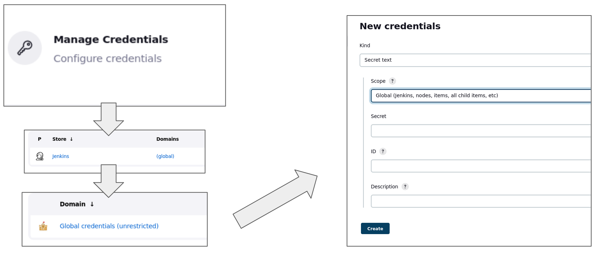
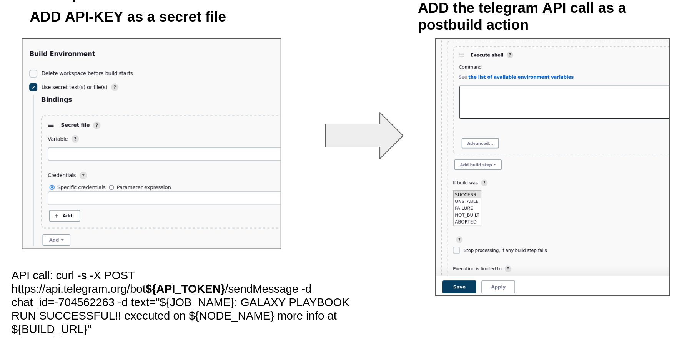

# Telegram bot for Jenkins notifications
## Bot 
### Bot creation
Create a simple Telegram bot using [Botfather](https://telegram.me/BotFather) a guide can be read at [https://riptutorial.com/telegram-bot/example/25075/create-a-bot-with-the-botfather](https://riptutorial.com/telegram-bot/example/25075/create-a-bot-with-the-botfather)

Bothfather will respond with a token to access the [http API](https://core.telegram.org/bots/api) 
These credential will be used to access the telegram api, giving the bot the possibility to send messages to specific chat.

### Bot setup  
- Add the newly created bot to a group chat
- Retrive the id of the chat by looking at the chat object in the list of updates for your bot:
  `https://api.telegram.org/bot<YourBOTToken>/getUpdates` [more-info](https://stackoverflow.com/questions/32423837/telegram-bot-how-to-get-a-group-chat-id) 

- Test the Bot sending a messagge to the bot using curl, example:
  ```bash
  curl -s -X POST https://api.telegram.org/bot<API_TOKEN>/sendMessage -d chat_id=<chat id> -d text="TEST BOT"
  ```

## Configure Jenkins to notify on telegram

### Save Bot credentials

On jenkins, in the credential management, save the bot token as secret text:


### Install the required plugin

Install the [required plugin](https://plugins.jenkins.io/postbuildscript/) needed to run script in postbuild


#### Configure jobs and JenkinsFiles

Using the telegram API through [curl](#bot-setup) coupled with the postbuildscript plugin we can set up a notification system, that alerts us of the outcome of each job. 


**Free Style project**



**Pipeline**

``` groovy
pipeline {
	stages {
		stage('deploy') {
			steps {
            .........
				}
			}
		}
	}
	post { #post script execution
		always { 
			cleanWs()
		}
		success {
			withCredentials([string(credentialsId: 'telegram_bot_API_token', variable: 'API_TOKEN')]) {
				sh '''
				if [ -f /tmp/galaxy_screenshot.png ]; then
                                    for photo in /tmp/galaxy_screenshot*.png; do
                                        curl https://api.telegram.org/bot$API_TOKEN/sendphoto -F "chat_id=-667232678" -F "photo=@${photo}" -F "caption=${JOB_NAME}: SUCCESS!! executed on ${NODE_NAME} more info at ${BUILD_URL}"
                                    done
                                    rm /tmp/galaxy_screenshot*.png
				else
				    curl -s -X POST https://api.telegram.org/bot$API_TOKEN/sendMessage -d chat_id=-667232678 -d text="${JOB_NAME}: SUCCESS!! executed on ${NODE_NAME} more info at ${BUILD_URL}"
				fi
				'''
			}
		}
		failure {
			withCredentials([string(credentialsId: 'telegram_bot_API_token', variable: 'API_TOKEN')]) {
				sh 'curl -s -X POST https://api.telegram.org/bot$API_TOKEN/sendMessage -d chat_id=-667232678 -d text="${JOB_NAME}: FAIL!! executed on ${NODE_NAME} more info at ${BUILD_URL}"'
			}
		}
	}
}
```


