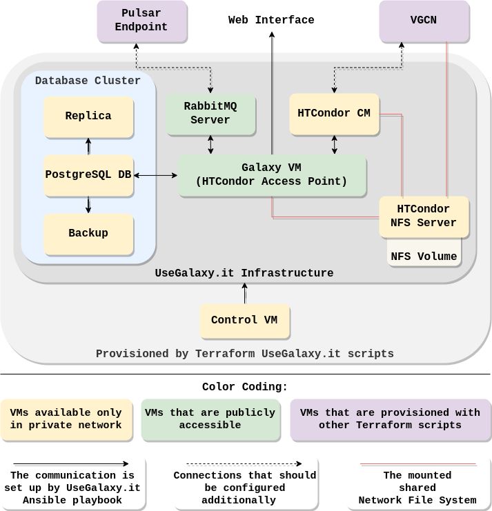

# Deployment of UseGalaxy.it

## Infrastructure

The infrastructure for UseGalaxy.it was deployed on the High-Performance Computing environment, ADA CLOUD, based on the OpenStack version Wallaby Cloud Platform.   
The infrastructure consists of a set of virtual machines, each of which has different resources allocated (CPU, RAM, storage) and network settings.  

### The UseGalaxy.it architecture concept  
  

The UseGalaxy.it infrastructure Terraform scripts create a database cluster, parts of the HTCondor pool, Galaxy VM, RabbitMQ server, and Control VM. The Control VM is used for the following configuration of other VMs.  

VGCN (Virtual Galaxy Compute Nodes) and Pulsar Endpoint are provisioned separately.

### UseGalaxy.it virtual machines’ (ADA CLOUD) flavours and images
| Virtual Machine | Flavour Type | vCPUs | RAM (GB) | Storage (GB) | Base Image    |
| --------------- | ------------ | ----- | -------- | ------------ | ------------- |
| PostgreSQL DB   | fl.ada.l     | 16    | 120      | 30           | Rocky Linux 9 |
| Backup          | fl.ada.s     | 4     | 30       | 30           | Rocky Linux 9 |
| Replica         | fl.ada.s     | 4     | 30       | 30           | Rocky Linux 9 |
| HTCondor CM     | fl.ada.s     | 4     | 30       | 30           | VGGP          |
| NFS Server      | fl.ada.m     | 8     | 60       | 30           | VGGP          |
| RabbitMQ Server | fl.ada.s     | 4     | 30       | 30           | Rocky Linux 9 |
| Galaxy VM       | fl.ada.l     | 16    | 120      | 30           | Rocky Linux 9 |
| Control VM      | fl.ada.s     | 4     | 30       | 30           | Rocky Linux 9 |

The available storage is complemented by a 300 GB volume attached to the NFS server.  

### Infrastructure repos
| Component                   | Repository                                          |
| --------------------------- | --------------------------------------------------- |
| UseGalaxy.it Infrastructure | https://github.com/usegalaxy-it/infrastructure      |
| VGCN Infrastructure         | https://github.com/usegalaxy-it/vgcn-infrastructure |
| Pulsar Endoint Deployment   | https://github.com/usegalaxy-eu/pulsar-deployment   |


## Configuration

The configuration of the virtual machines has been defined by a set of Ansible playbooks available [here](https://github.com/usegalaxy-it/infrastructure-playbook).

### Configuration steps

The order of VMs’ configuration is important as some software applications may be dependent on others. They were configured in the following order:

1. Database Cluster (`db_cluster.yml`)
   - Backup server 
   - PostgreSQL Database server
   - Replica server
2. NFS server (`mount.yml`)
3. HTCondor Central Manager (`central-manager.yml`)
4. Galaxy VM (`sn06.yml`)
5. RabbitMQ server (`rabbitmq.yml`)

First, check the `hosts` inventory file for entries that should be populated after running Terraform (IP adresses of machines and FQDNs).   
Two virtual machines (RabbitMQ and Galaxy) will be accessed over HTTPS and require **FQDNs** for issuing SSL/TLS certificates.

Ansible commands for each configuration step (the placeholder `<playbook.yml>` is substituted by the necessary playbook):

```bash
ansible-playbook --private-key <path_to_priv_cloud_key> -i hosts <playbook.yml>
```

For configuring Galaxy, the Galaxy directory permissions are passed as extra variable:

```bash
ansible-playbook --private-key <path_to_priv_cloud_key> -i hosts sn06.yml --extra-vars "__galaxy_dir_perms='0755'"
```

### "Rebuild Galaxy VM" case

1. Rerun `mount.yml` to mount `/opt/galaxy` (the Galaxy server directory, to which the Galaxy application code is copied as some Galaxy tool wrappers require a copy of the Galaxy codebase itself to run) and `/data/share`  (the shared data directory, where all the user jobs store input and output data, and information about job execution processes) to Galaxy VM
```bash
ansible-playbook --private-key <path_to_priv_cloud_key> -i hosts mount.yml
```
2. Comment out `usegalaxy-eu.autofs` role in `sn06.yml`, if it's not disabled
3. Run `sn06.yml` playbook
```bash
ansible-playbook --private-key <path_to_priv_cloud_key> -i hosts sn06.yml --extra-vars "__galaxy_dir_perms='0755'"
```
4. Check HTCondor logs
```bash 
sudo tail /var/log/condor/SchedLog
```

If it throws error like `ERROR: AUTHENTICATE:1003:Failed to authenticate with any method|AUTHENTICATE:1004:Failed to authenticate using FS|AUTHENTICATE:1004:Failed to authenticate using IDTOKENS`, you need to update the IDTOKEN:
- ssh to HTCondor CM and copy IDTOKEN from `/etc/condor/tokens.d/condor@<CM_IP>`
- ssh to Galaxy VM and write IDTOKEN to `/etc/condor/tokens.d/condor@<GalaxyVM_IP>`


## References

[UseGalaxy.it Infrastructure](https://github.com/usegalaxy-it/infrastructure) Terraform scripts  
[VGCN Infrastructure](https://github.com/usegalaxy-it/vgcn-infrastructure)  
[Pulsar Endoint Deployment](https://github.com/usegalaxy-eu/pulsar-deployment) Terraform scripts  
[UseGalaxy.it Ansible playbooks](https://github.com/usegalaxy-it/infrastructure-playbook)


## Author Information

[Polina Khmelevskaia](https://github.com/po-khmel)