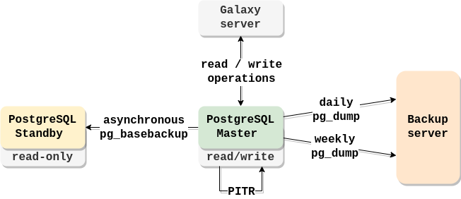

# PostgreSQL Backup
- [PostgreSQL Backup](#postgresql-backup)
  - [Introduction](#introduction)
  - [Requirements](#requirements)
  - [pg\_dump](#pg_dump)
  - [pg\_basebackup aka Replication](#pg_basebackup-aka-replication)
  - [Point-in-Time Recovery](#point-in-time-recovery)
  - [References](#references)
  - [Author Information](#author-information)

## Introduction

Three common backup methods in PostgreSQL are **pg_dump**, **pg_basebackup** and **Point-in-Time Recovery** (PITR).  

1. `pg_dump`: pg_dump is a utility in PostgreSQL used for *logical backups*. It generates a text file containing SQL commands that can be used to recreate the database objects and data. The pg_dump command allows you to specify which database(s) to back up, and you can also choose to back up specific tables, schemas, or other database elements. This type of backup is primarily used for small to medium-sized databases and is suitable for routine backups and selective restoration of data.  

2. `pg_basebackup`: pg_basebackup is a utility that performs a *physical backup* of the PostgreSQL cluster files. It creates an exact copy of the database cluster, including the data files and transaction logs. It can be used for replication purposes. **Replication** is the process of synchronizing data between multiple database instances to achieve high availability, load balancing, or disaster recovery. This type of backup is commonly used for large databases or situations where faster backup and restoration are required. It captures the entire database cluster at a point in time.  

3. `Point-in-Time Recovery (PITR)`: Point-in-Time Recovery is a technique in PostgreSQL that allows you to restore a database to a specific point in time. PITR requires a combination of both *logical and physical backups*. It utilizes the transaction logs (WAL - Write-Ahead Logs) generated by PostgreSQL to replay the transactions and bring the database to a desired state. With PITR, you can recover your database to any point between the time of the last backup and the present moment, providing a higher level of data protection and flexibility.  

These Backup methods are not mutually exclusive and can be used in combination to ensure comprehensive data protection and recovery strategies for PostgreSQL databases.  
  
*At Usegalaxy.it all three types of backups are implemented.*



## Requirements

Ansible >= 2.9

Infrastructure:  
  
| Resource           | Recommended Images | PostgreSQL |
| ------------------ | ------------------ | ---------- |
| Database Master VM | RockyLinux 9       | required   |
| Replica VM         | RockyLinux 9       | required   |
| Backup VM          | RockyLinux 9       | no         |

## pg_dump

To implement this backup feature, the [`usegalaxy-it.postgres-backup`](https://github.com/usegalaxy-it/usegalaxy-it.postgres-backup) Ansible role is used. This role configures the Backup server and the Master VM, which serves as the PostgreSQL server, to perform backups using pg_dump.

Here's an explanation of the main pg_dump command that is executed by cron job. It performs a logical backup of the PostgreSQL database, compresses it in custom format, and saves it to the specified local directory with a timestamped filename:

```bash
pg_dump -U <postgresql_user_name> -Fc $DATABASE > $LOCAL_BACKUP_DIR/$TIMESTAMP.backup
```
- `-U <postgresql_user_name>`: the PostgreSQL user name to connect to the database.
- `-Fc`: specifies the custom format for the backup file. It compresses the backup, making it more efficient for storage.
- `$DATABASE`: the name of the PostgreSQL database being backed up. Default to `galaxy`
- `$LOCAL_BACKUP_DIR`: the local directory path where the backup file will be stored.
- `$TIMESTAMP.backup`: the timestamped name of the backup file.

After the backup is created, it is copied to the remote Backup server for safekeeping, and the local copy is removed.  
Backup is performed daily and weekly.  
The role also takes care of cleaning up old backups, ensuring that only the most recent backups are retained.

**NB!** To enable this feature, set the variable `postgres_backup: true` in your var file.  

Exapmle Ansible Playbook:

```YAML
- name: PostgreSQL server
  hosts: <pgsql_host>
  become: true
  roles:
    - role: usegalaxy-it.postgres_backup
      become: true
      vars: 
        backup_role: database
        postgresql_user_name: postgres
        backup_ip: <backup_host_ip>
      when: postgres_backup

- name: Backup server
  hosts: <backup_host>
  become: true
  roles:  
    - role: usegalaxy-it.postgres_backup
      become: true
      vars: 
        backup_role: backup
        postgresql_user_name: postgres
        backup_ip: <backup_host_ip>      
      when: postgres_backup
```

You can use `pg_restore` command to restore the dumped database.  

```bash
pg_restore -U <postgresql_user_name> -C -d <database_name> <backup_file>
```

## pg_basebackup aka Replication

The replication process (which is also a type of backup) is implemented by [usegalaxy-it.postgres-replication](https://github.com/usegalaxy-it/usegalaxy-it.postgres-replication) Ansible role. The role configures Master server (PostgreSQL server) and Standby server (Replica) for a basic replication process. It should be run on servers with running PostgreSQL and same postgres user.  
The default role adjusts PGSQL configuration on both VMs to set up asynchronous replication (which is more reliable, but slower then synchronous) and grants authorization of Replica VM. The main PostgreSQL replication command is:   

```bash
pg_basebackup -D <replica_data_path> -h <master_ip> -U <replica_user_name> -R -X stream
```
- `-D <replica_data_path>`: the directory where the replicated data will be stored on the standby server.  
- `-h <master_ip>`: the IP address of the primary server (Master) from which the replication will be performed.  
- `-U <replica_user_name>`: replica username that has the necessary permissions to perform the replication.  
- `-R`: creates a `standby.signal` file on the standby server. This file serves as a marker to indicate that the standby server is intended for replication.
- `X stream`: the method of transferring the transaction logs (WAL files) from the primary server to the standby server. The stream method uses a continuous streaming replication protocol to send the WAL files in real-time.  

Once the replication process is set up, all the changes in the database on Master server will be synchronized with Standby.  

**NB!** To enable this feature, set the variable `postgres_replication: true` in your var file. 
Set sensitive value in a vault encrypted file.  

Example playbook:

```YAML
- name: PostgreSQL server
  hosts: <pgsql_host>
  become: true
  roles:
    - role: usegalaxy-it.postgres_replication
      become: true
      vars: 
        replication_role: master
        replica_user_name: replica
        master_ip: <pgsql_host_ip>
        replica_ip: <replica_host_ip>
        replica_user_password: <replica_user_password> # sensitive value
      when: postgres_replication

- name: Standby server
  hosts: <replica_host>
  become: true
  roles:
    - galaxyproject.postgresql
    - role: usegalaxy-it.postgres_replication
      become: true
      vars: 
        replication_role: standby
        replica_user_name: replica
        master_ip: <pgsql_host_ip>
        replica_ip: <replica_host_ip>
        replica_user_password: <replica_user_password> # sensitive value
      when: postgres_replication
```

## Point-in-Time Recovery

This backup method is delivered by [`galaxyproject.postgresql`](https://github.com/galaxyproject/ansible-postgresql) Ansible role. Apart from system hadling and management, 2 important scripts are used in this role:  
1. The `backup.py` Python script provides a utility for performing PostgreSQL PITR backups using rsync and other PostgreSQL-related commands. It supports options for initiating backups, keeping a certain number of backups, cleaning the WAL archive, etc.  
2. The `archive_wal.sh` bash script is invoked by PostgreSQL as the `archive_command`. It is responsible for archiving WAL files by copying them to the specified WAL archive directory using rsync.  

However there are limitations in this Ansible role:  
- cleaning of WAL archive is not possible, because `--clean-archive` flag cannot be used with remote backup directories as it's coded in `backup.py` script;  
- overwriting of WAL archive is not allowed by `archive_wal.sh`.    

Thus, it is only possible to implement PITR locally (to improve this situation, other backup methods were developed. They were described above).  

To enable PITR it's enough to indicate `postgresql_backup_dir` at PostgreSQL installation step.   
- `postgresql_backup_rsync_backup_opts`: Rsync options. Must be set in the next form: `'-r -p -t -g'`  
Example Ansible Playbook:

```YAML
- name: Postgresql DB
  hosts: <pgsql_host>
  become: true
  become_user: root
  roles:
    - role: galaxyproject.postgresql
      vars: 
        postgresql_backup_dir: /archive
        postgresql_backup_rsync_backup_opts: '-r -p -t -g'
        # .......
        # other variables needed for installation process
    - role: galaxyproject.postgresql_objects
      become: true
      become_user: postgres

```

## References

[PostgreSQL Documentation](https://www.postgresql.org/docs/)  
[pg_dump Utility Documentation](https://www.postgresql.org/docs/current/app-pgdump.html)  
[pg_basebackup Utility Documentation](https://www.postgresql.org/docs/15/app-pgbasebackup.htm)  
[Continuous Archiving and Point-in-Time Recovery (PITR) Documentation](https://www.postgresql.org/docs/current/continuous-archiving.html)  
[PostgreSQL Backup Stratagies](https://www.enterprisedb.com/postgresql-database-backup-recovery-what-works-wal-pitr)  
[usegalaxy-it.postgres-replication](https://github.com/usegalaxy-it/usegalaxy-it.postgres-replication) Ansible role  
[usegalaxy-it.postgres-backup](https://github.com/usegalaxy-it/usegalaxy-it.postgres-backup) Ansible role  
[galaxyproject.postgresql](https://github.com/galaxyproject/ansible-postgresql) Ansible role  

## Author Information

[Polina Khmelevskaia](https://github.com/po-khmel)